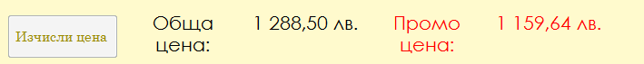

# ComputerPartsApp
WinForms application for building computer configurations


# Приложение “Компютърен магазин”

Приложението дава възможност на потребителя да създаде
своя компютърна конфигурация, използвайки предварително (или динамично)
въведени комп. части.


Всеки конкретен основен компютърен компонент (процесор, дънна платка,
RAM памет, видеокарта, монитор, захранване, устройство за съхранение
(HDD или SSD), кутия (case), клавиатура, мишка, аудиоустройство)
представлява отделен клас, наследяващ базовия абстрактен клас **Part** или негов клас-наследник.

Всички компоненти споделят някои базови характеристики
(свойствата Производител, Марка, Модел, Цена, Изображение, Линк към
частта в онлайн магазин и дали в момента цената и е намалена), но всеки
един от тях притежава и свои собствени свойства, отговарящи на неговите
конкретни качества ( за CPU - честота, архитектура, брой ядра, сегмент,
технология, размер на кеша; за MotherBoard - форм-фактор, тип гнездо за
процесора, чипсет, тип на паметта; за RAM - капацитет, тип, скорост
(честота), за видеокарта - чипсет, интерфейс, тип и размер на паметта,
PSU - мощност, размери, форм-фактор, ефективност, големина на
вентилатора; за Case - форм-фактор, размери, брой гнезда за устройства,
брой слотове, макс. брой вентилатори, дали поддържа водно охлаждане; за
монитор - размер, резолюция, вид дисплей и вид панел; за клавиатура -
вид на клавишите, форм-фактор, подредба, локализация, време за реакция,
размери, дали е безжична; за мишка - вид, скорост, брой бутони, тегло,
размери, сензор, дали е безжична; за аудиоустройство - вид, мощност,
честотен диапазон, размери, тегло, цвят,...).


Налице  са и два класа HDD и SSD, наследяващи друг
абстрактен клас Drive, който от своя страна е наследник на Part. Този
факт е породен от близката връзка в предназначението на двата обекта, но
и фундаменталната разлика в тяхното устройство.

Класът Part имплементира интерфейса **IComparable&lt;Part&gt;**, реализиран
така, че да сравнява частите по цена. Като наследник на базовия клас в
C\# System.Object, Part пренаписва част от неговите виртуални методи, с
цел да бъдат пригодени към конкретната реализация. Методът ToString()
връща текстов низ, образуван от производителя, марката, модела и цената
на съответната част. За да се подсигури коректна функционалност на
GetHashCode(), той връща хеш-кода на низа от ToString(). Методът
Equals() сравнява частите по техните производители, имена и модели.
Добавени са и функции, които да отворят уеб-страница на съответната част
в онлайн магазин в браузъра, както и изображение на частта в Windows
Photo Viewer. Класът Part съдържа абстрактен метод GetPartInfo(), който
е пренаписан в отделните наследници и връща кратка информация за
функцията на съответната част в типичната компютърна система.


Налични са и други функции, свързани с потребителския
интерфейс на приложението. Потребителят има възможността да приложи код
за отстъпка от цената на конфигурацията (валидните кодове и намаленията,
които осигурават, се съхраняват в речник (Dictionary)), както и да
получи разписка с избраните от него части в текстов файл. Добавена е
функция ToStringInFile(), както и абстрактния метод ToStringInCSV(),
реализиран по определен начин в отделните наследници.




Добавени са помощни структури за представяне на някои
дании. Размерите на съответните части се представят със struct,
съдържаща свойствата ширина, височина и дължина. Цветът и видът на
периферните устройства се представят чрез enum.

Периферните части имплементират интерфейса **IPeripheral**, с което се осигурява, че
всяка от тях трябва да съдържа свойство дали е безжична, дали е входно
или изходно у-во, нейните размери, тегло и цвят.

Приложението е предназначено за потребители новобранци,
чиито познания в сферата са ограничени. Този факт обуславя някои от
особеностите на реализацията. Могат да бъдат избирани само основните
компютърни компоненти, без които използването на съответната компютърна
система би било невъзможно или прекалено трудно. Допълнителни устройства
с конкретно предназначение, разширяващи основната функционалност, не са
налични.

При стартиране на приложението, то извлича всички
налични части от csv файл, а при затваряне - записва новите части, ако
има такива. Тази особеност е свързана с факта, че приложението съдържа
още един прозорец, който се достъпва от бутон на основната форма и дава
възможност за добавяне на нова част към текущия асортимент. Обикновеният
потребител няма достъп до тази функционалност. Тя е достъпна само чрез
въвеждане на потребителско име и парола и дава възможност на
администратор да добави нов продукт без да редактира директно .csv
файла, където се съхраняват всички останали компоненти.
Характеристиките, които трябва да бъдат въведени от него, се определят
от типа на съответната част, която той иска да добави. Спазени са някои
основни практики при съхраняване на името и паролата. Те не се съдържат
в кода директно (plain text), а под формата на хеш. При въвеждането на
данните те се преобразуват и при съвпадение потребителят получава
достъп.

```csv
"CPU","Intel","Pentium","G4560","138,15","..\\..\\..\\Items\\Images\\CPU\\57455.jpg","http://nikem-bg.net/computer-components/Intel-Pentium-G4560-3.50GHz-3MB-LGA1151/","3,5","Kaby Lake","2","Desktop","14nm","3"
"MotherBoard","ASRock","H310M-HDV","LGA1151","104,33","..\\..\\..\\Items\\Images\\MotherBoard\\60266.jpg","http://nikem-bg.net/computer-components/ASROCK-H310M-HDV-LGA1151/","MicroATX","1151","Intel H310","DDR4"
"RAM","Crucial","DRAM","CT4G4DFS8266","50,78","..\\..\\..\\Items\\Images\\RAM\\61032.jpg","http://nikem-bg.net/computer-components/CRUCIAL-4GB-DDR4-2666MHz-CL19-CT4G4DFS8266/","4","DDR4","2666"
"VideoCard","Asus","Mining","RX 470","253,67","..\\..\\..\\Items\\Images\\VideoCard\\60176.jpg","http://nikem-bg.net/computer-components/ASUS-MINING-RX470-8G-LED-S/","Radeon RX 470","PCI-Express 3.0","GDDR5","8"
"PSU","Seasonic","Focus SGX","SSR-450","134,652","..\\..\\..\\Items\\Images\\PSU\\61869.jpg","http://nikem-bg.net/computer-components/PSU-SEASONIC-SSR-450SGX-GOLD/","450","125,125,64","SFX/ATX","90","120"
"HDD","Toshiba","P300","HDWD110UZSVA","81,68","..\\..\\..\\Items\\Images\\HDD\\58584.jpg","http://nikem-bg.net/computer-components/HDD-Toshiba-P300-1TB-7200RPM-64MB-NCQ-AF-bulk-HDWD110UZSVA/","1000","SATA III","64","3,5","7200","6","False"
"Case","RaidMax","Gama","A18TB","71,092","..\\..\\..\\Items\\Images\\Case\\61038.jpg","http://nikem-bg.net/computer-components/RAIDMAX-GAMA-A18TB-Tower-ATX-Green-GAMA-A18TG_GREEN/","ATX Mid Tower","221,499,508","4","7","6","True"
"Monitor","Acer","R221Q","UMWR1EE001","209,45","..\\..\\..\\Items\\Images\\Monitor\\56595.jpg","http://nikem-bg.net/computer-components/ACER-21.5-R221QBMID-IPS-FHD/","21,5","Full HD","LED","IPS","False","1","498,302,34","3","0"
"Mouse","Cougar","MINOS X2","CG3MMX2WOB0001","36,64","..\\..\\..\\Items\\Images\\Mouse\\58603.jpg","http://nikem-bg.net/computer-components/COUGAR-MINOS-X2-Gaming-Mouse-CG3MMX2WOB0001/","Optical","3000","5","94","ADNS-3050","67,40,122","False","0","0"
"Keyboard","Asus","Strix Tactic Pro","B00N1MLRVK","175,79","..\\..\\..\\Items\\Images\\Keyboard\\52593.jpg","http://nikem-bg.net/computer-components/ASUS-STRIX-TACTIC-PRO-KB/","Mechanical","Full-size","QWERTY","English","1000","516,179,33","False","2400","0","0"
"Speakers","Logitech","S150","980-000029/481","32,27","..\\..\\..\\Items\\Images\\Speakers\\37029.jpg","http://nikem-bg.net/computer-components/LOGITECH-S150-SPEAKER-USB-BLCK/","2","1,2","90Hz - 20kHZ","False","1","68,158,64","400","0"
```

Потребителският интерфейс на приложението предлага
няколко възможности на потребителя. От основния прозорец, той ще може да
създаде своя компютърна система, избирайки от списъци конкретните части,
да види информация за всяка от частите, да отвори нейно изображение или
уеб-страница, да види общата цена. Достъпен е бутон, пренасочващ към
прозорец за прилагане на код за отстъпка, както и бутон, отварящ
диалогов прозорец за запис на разписка на готовата система в текстов
файл.


Вътрешно компютърната конфигурация е представена чрез клас **Computer**, съдържащ списък със своите
части. Част от методите на Computer са GetPrice(), връщащ общата
стойност, и SaveToFile(), който използва StreamWriter от System.IO за да
запише конфиг. в текстов файл, AddPart(Part part) и RemovePart(Part
part) съответно за добавяне и премахване на част, два indexer-а за
достъпа на частите(чрез текстов низ и тип) и ApplyCoupon() за прилагане
на код за отстъпка.

Класът имплементира интерфейсите **IEnumerable** и **Comparable**, което позволява
отделните части да бъдат обхождани и сравнявани по даден признак. Така в
друг прозорец потребителят има достъп до някои статистически данни
(най-скъпа част, най- евтина част, средна цена на част, медиана на
цената и др.).
